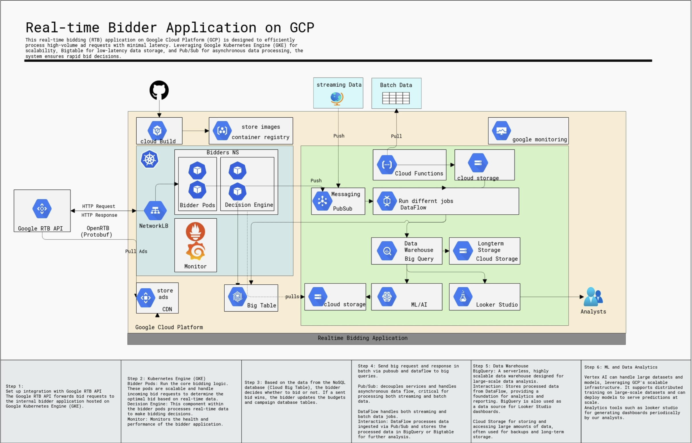

# Real-Time Bidder Application on Google Cloud Platform (GCP)

## Overview

This guide outlines the architecture and design of a real-time bidding (RTB) application on Google Cloud Platform (GCP). The system is built to process high-volume ad requests with minimal latency, ensuring scalability, security, and compliance.

## Architecture Modules

### 1. Data Ingestion

#### **Components**
- **Pub/Sub**: Core messaging service for ingesting data asynchronously from various sources.
- **Streaming Data**: Ingests real-time user interactions and market data.
- **Batch Data**: Periodically ingested historical and less time-sensitive data.

#### **Interaction**
- Pub/Sub ingests streaming and batch data, distributing it to DataFlow for processing.

### 2. Data Transformation

#### **Components**
- **DataFlow**: Handles ETL (Extract, Transform, Load) operations, converting raw data into a structured format.

#### **Interaction**
- DataFlow processes incoming data from Pub/Sub and prepares it for storage in BigQuery and Bigtable.

### 3. Data Storage

#### **Components**
- **Bigtable**: NoSQL database optimized for low-latency, high-throughput operations.
- **BigQuery**: Scalable, serverless data warehouse for large-scale data analysis.

#### **Interaction**
- Bigtable stores real-time bidding data, while BigQuery holds processed data for analytics and reporting.

### 4. Real-Time Processing

#### **Components**
- **GKE (Google Kubernetes Engine)**: Orchestrates containerized bidder pods.
  - **Bidder Pods**: Run the bidding logic.
  - **Decision Engine**: Executes real-time bid decisions using data from Bigtable.

#### **Interaction**
- GKE hosts the bidder pods that process bid requests from the Google RTB API, accessing data from Bigtable to optimize bids.

### 5. Integration with Google Ads

#### **Components**
- **Google RTB API**: Interfaces for receiving and responding to real-time bid requests.
- **App Engine**: Hosts custom services for integration with Google Ads and other platforms.

#### **Interaction**
- Bidder pods respond to real-time bid requests, ensuring synchronized bid submission to ad exchanges and Google Ads.

### 6. Security and Compliance

#### **Components**
- **IAM (Identity and Access Management)**: Controls access to GCP resources, enforcing the principle of least privilege.
- **Cloud Key Management Service (KMS)**: Manages encryption keys for data at rest.
- **VPC Service Controls**: Establishes security perimeters around GCP resources.
- **Google Monitoring**: Tracks security events and audit logs.

#### **Interaction**
- Data is encrypted both at rest and in transit using managed keys. IAM roles restrict access, and VPC Service Controls and Google Monitoring ensure compliance and security.

### 7. Monitoring and Maintenance

#### **Components**
- **Google Monitoring**: Monitors system health and performance metrics.
- **Cloud Logging**: Captures operational logs for visibility and troubleshooting.
- **Cloud Build**: Automates the CI/CD pipeline.
- **BigQuery and Bigtable Backups**: Regular backups ensure data integrity and disaster recovery.

#### **Interaction**
- Google Monitoring and Cloud Logging track performance and security. Cloud Build automates deployments, and regular backups safeguard data.

## Potential Challenges and Mitigation Strategies

### 1. Latency
- **Challenge**: RTB systems require ultra-low latency.
- **Mitigation**:
  - Use **Network Load Balancer** for efficient traffic distribution.
  - Leverage **Bigtable** for low-latency data access.
  - **Regional Deployment** minimizes data travel time.

### 2. Scalability
- **Challenge**: Handling fluctuating traffic loads.
- **Mitigation**:
  - **GKE Autoscaling** adjusts bidder pods based on traffic.
  - **Pub/Sub** and **DataFlow** automatically scale with data volume.

### 3. Security and Compliance
- **Challenge**: Ensuring data security and regulatory compliance.
- **Mitigation**:
  - **Encryption** at rest and in transit with Cloud KMS.
  - **IAM** roles and **VPC Service Controls** for access control.
  - **GDPR Compliance** with data anonymization and access management.

### 4. Cost Management
- **Challenge**: Managing high-availability system costs.
- **Mitigation**:
  - Use **Preemptible VMs** for non-critical tasks.
  - **Cloud Storage Tiers** for cost-effective data storage.
  - **Monitoring** for resource optimization and cost alerts.

## Conclusion

This real-time bidding application on GCP is engineered for performance, scalability, and security. The architecture leverages GCP’s powerful services to ensure low-latency processing, high availability, and robust compliance with industry regulations.
